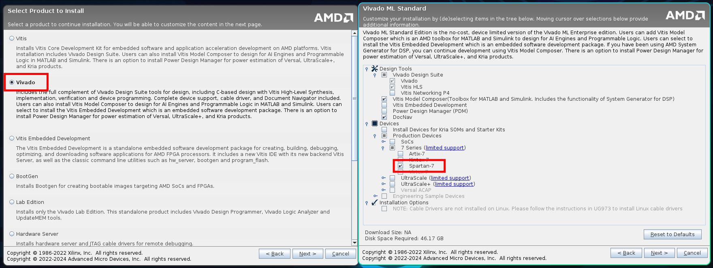
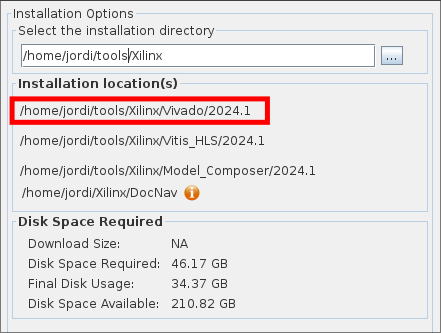
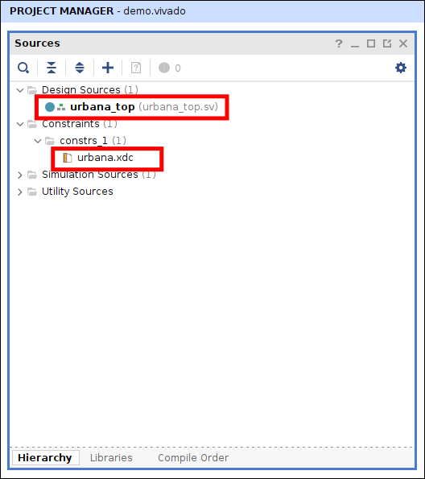
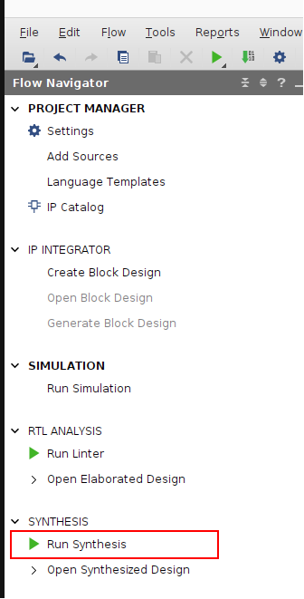
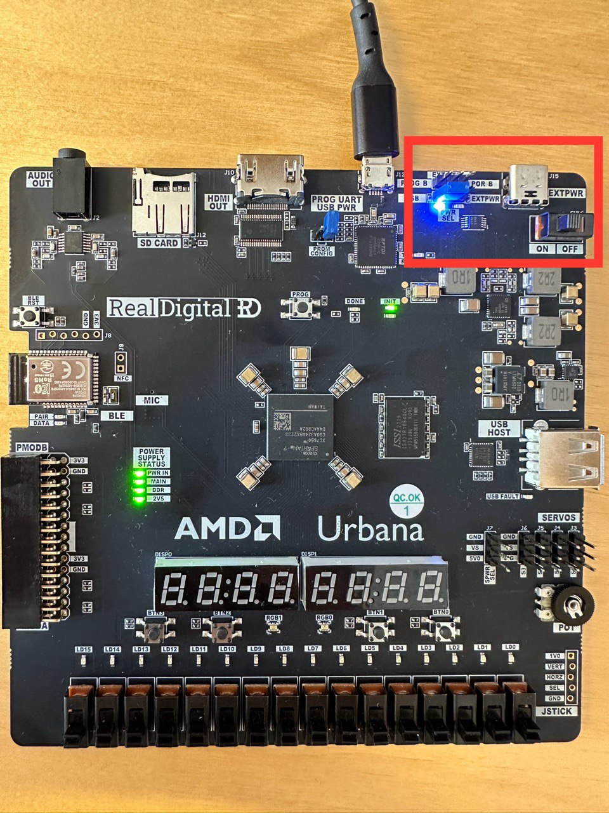
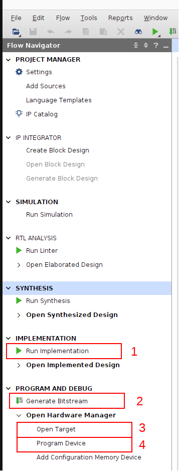
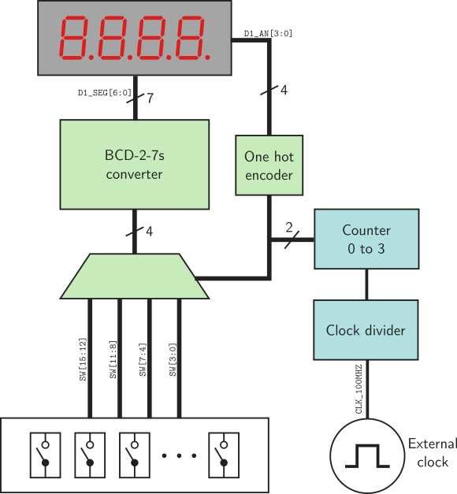

# Introduction to Vivado
In this lab, you will learn the basics of Vivado, the Xilinx FPGA development tool that we will use in the IL2234 course.

## Installation
Follow the instructions found on [the AMD website](https://www.xilinx.com/support/download.html). You will need to register to download the software.

When installing, make sure you choose Vivado and then the ML Standard edition, and enable support for Spartan 7-series FPGA devices.



### Adding Vivado to PATH
To run Vivado commands from the command line interface, we need to add the Vivado installation folder to the PATH environment variables.

The installation PATH of Vivado is specified during the installation process:



Depending on your OS, do the following
#### Linux & MacOS
Add the path in your bashrc/zshrc or equivalent file. For example:
```bash
export PATH=${PATH}:/home/jordi/toolsXilinx/Vivado/2024.i/bin
```
Make sure to add `bin` at the end of the path.

NOTE: jordi is an example here. Add your specific installation path.
#### Windows
Search "environmental variables" in the start menu
Add the Vivado path in the PATH variable for your user

## Starting Vivado and recreating the project
To follow the lab, you will recreate a project template provided in this git repository. To do that, clone the git repository in the repository of your choice and run the `rebuild.tcl` script with Vivado.

```bash
git clone git@github.com:silagokth/il2234-lab-demo.git lab1
cd lab1
vivado -source rebuild.tcl
```
This should launch Vivado, recreate the project with the correct configuration for the FPGA we will use, and load the source and constraints files. After loading your project should look similar to this, with `urbana_top.sv` and `urbana.xdc` files shown.

## Urbana development board
For this course, we will use [RealDigital's Urbana](https://www.realdigital.org/hardware/urbana) as the FPGA development board. On the website, you can find a description of all the resources, peripherals, and extra hardware included in the development board and the Spartan7 FPGA. This includes switches, buttons, LEDs, and 7-segment displays, among others. All these devices are connected to the FPGA input/output pins as described in the [schematic](https://www.realdigital.org/downloads/064514e67fbab05a00650ce69af02486.pdf) of the development board. We will use the buttons, switches and 7-segment displays for these labs, but feel free to explore how other devices are also integrated.
### Constraints file
The constraints file `urbana.xdc` includes, among others, the definitions of the pins and their names. For example, if you open the file, you can see that pin G1 is named SW[0], which means that it is connected to the SW0 switch on the PCB. Similarly, all other devices on the PCB are listed on the constraints file with their name and the pin to which they are connected. For us, it is important to pay attention to the name at the end of each line, as this is how we will be referring to the pins in our RTL code.


## First design
For our first design, we will connect a switch to a LED.
### Adding module ports
For Vivado to be able to connect our design to the desired FPGA pins, we need to specify the *exact* name in the port list as found in the constraints file. Note that names with `[xx]` are arrays and have to be listed as such. For example, to add the LEDs, we should add the following in `urbana_top.sv`:
```systemverilog
module urbana_top (
   output logic [15:0]LED
   );
```
What should we do to add the switches? Hint: look at the constraints file and the schematic to find out the names

### Connecting things together

Let's say we want to connect switch 9 with LED 4. To do that, we can use an `assign` statement in our top module RTL as follows:
```systemverilog
module urbana_top (
    output logic [15:0]LED,
    input  logic [15:0]SW
    );

    assign LED[4] = SW[9];
endmodule
```

### Synthesizing the design
To transform our RTL code into a gate-level version, we have to run logic synthesis. Click the green triangle in the left menu, "Run Synthesis." After the synthesis is finished, we can view the resulting schematic by pressing the "Schematic" button.


Does the schematic match our expected design?

### Loading the design in the FPGA
We first need to run the Implementation to load the design into the FPGA. This will map each gate on our synthesized schematic to a specific logic element of the FPGA and connect everything together using the routing resources. 

After the implementation process finishes, we must generate the *bitstream*. This contains the information that will be sent to the FPGA, which contains all the connections and settings that need to be made inside the FPGA to correctly implement our design.

After the bitstream has been generated, we can connect to the FPGA and program it. Under PROGRAM AND DEBUG, click *Open Target*. This should connect to the FPGA. If this does not happen, make sure the FPGA is turned on, and check if your [drivers are installed correctly](https://docs.amd.com/r/en-US/ug973-vivado-release-notes-install-license/Install-Cable-Drivers). 

Make sure to connect the FPGA power as specified in the [Urbana Board Reference Manual](https://www.realdigital.org/doc/496fed57c6b275735fe24c85de5718c2). Ensure the jumper is set to the correct position. 



After the hardware is detected, you can click Program Device and upload the bitstream.



Now your FPGA should have implemented the design that we implemented in RTL. Try if the switch turns the LED on.

## LED blinking
Another typical starter example is to make an LED blink. If you have worked with microcontrollers before (for example, Arduino), you might think this is very easy to do: turn the LED on, wait, turn it off, wait, repeat. However, an FPGA is not a processor that executes instructions, and thus, if we want to make the LED blink, we have to generate a signal that "blinks" (switches) at the desired frequency.

### Clock divider
The common way to generate these types of signals is to use a clock divider. We will use the input 100 MHz clock of the FPGA and divide it down to 1 Hz. For that, we will create a clock divider module, and we will later connect that to the LED.

A simple way to divide the clock is to implement a counter.
```systemverilog
module clock_divider #(
    parameter int DIVISOR
    ) (
    input  logic rst_n,
    input  logic clk_in,
    output logic clk_out
    );

    // counter signal
    logic [$clog2(DIVISOR)-1:0] counter;

     always_ff @(posedge clk_in or negedge rst_n) begin
       if (!rst_n) begin
         counter <= DIVISOR;
         clk_out <= 0;
       end else begin
         if (counter == 0) begin
           counter <= DIVISOR;
           clk_out <= ~clk_out;
         end else begin
           counter <= counter - 1;
         end
       end
     end
endmodule
```

Now we can connect the counter to an LED and divide by 100000000.
```systemverilog
module urbana_top (
    output logic [15:0]LED,
    input  logic [3:0]BTN, //Push buttons on the board
    input  logic CLK_100MHZ
    );

    // instantiate clock divider
    clock_divider #(
        .DIVISOR(100000000)
        ) clock_divider_inst (
        .rst_n(~BTN[0]),
        .clk_in(CLK_100MHZ),
        .clk_out(LED[0])
    );
endmodule
```
Repeat the steps from before to synthesize and program the FPGA. 

## 7 segment displays
The Urbana board includes two 4-digit 7-segment displays. To understand how the displays are connected to the FPGA, take a look at the schematic and the [7 segment module datasheet](http://www.lucky-light.com/LED%20Displays/Four%20Digit%20Display/KW4-281.pdf).

You might ask yourself, each module has four digits with 7 segments each. That is a total of 8 connections per digit (including the dot) times four digits, 32 connections. However, the KW4-281 module only has 12 pins.

The reason is that the digits of the display are *multiplexed*. This means that the module takes a 1-digit input and a 4-bit (one hot encoded) digit select signal and displays the input number on the selected digit. To display four digits simultaneously, we have to *multiplex* (i.e., switch very fast) between the digits at a frequency that our eye cannot perceive.

We will start with a simpler task by displaying a single digit. First, we need to convert the digit input (encoded in BCD) into the individual segment outputs. For that, we will use a lookup table.

```systemverilog
module bcd27s (
    input  logic [3:0] bcd,
    output logic [6:0] seg
);

  always_comb begin
    case (bcd)
      4'b0000: seg = 7'b1000000;
      4'b0001: seg = 7'b1111001;
      4'b0010: seg = 7'b0100100;
      4'b0011: seg = 7'b0110000;
      4'b0100: seg = 7'b0011001;
      4'b0101: seg = 7'b0010010;
      4'b0110: seg = 7'b0000010;
      4'b0111: seg = 7'b1111000;
      4'b1000: seg = 7'b0000000;
      4'b1001: seg = 7'b0010000;
      default: seg = 7'b1111111;
    endcase
  end
endmodule
```

Now we will connect four switches as our input digit and the output of the 7s converter to the 7s displays. What do we need to add as the input/output ports of our top level?

```systemverilog
module urbana_top (
    output logic [15:0]SW,
    // 7 segment digits output port
    // 7 segment digit selector output port
    );

    // instantiate the bcd27s converter
    bcd27s bcd27s_inst (
        .bcd(SW[3:0]),
        .seg(D0_SEG)
    );

    // Select which digit we want (note, they are active low!!)
    assign D0_AN = 4'b1011; // Digit 3 is activated
endmodule
```

Repeat the steps and program the synthesized bitstream.

## Multiplexing the displays
To drive the 4 7 segment digits, we will have to multiplex them at a frequency that is fast enough for our eye to perceive it as continuously on; we will use 1 kHz. This means that we need to again divide down the 100 MHz clock signal as we did before. Then, we must switch digits at every 1 kHz clock tick.


